# 空气动力学试验的概念

空气动力学试验是探索流体动力学现象、服务飞行器研制的核心手段。它融合了理论、工程与艺术，旨在通过物理模拟和相似理论，求解流体的**流动状态**和流体中**物体的受力**。

## 什么是风洞？

根据权威的军事术语定义，风洞是一种能够人工产生并控制气流，用以模拟飞行器或物体周围气体流动情况的管道状试验设备。

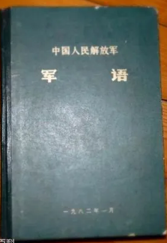

简而言之，风洞的核心功用就是通过物理模拟和相似理论，研究流体的**流动状态**以及流体与物体的**相互作用力**。除了风洞，飞行试验、数值模拟（CFD）也是空气动力学研究的重要手段。

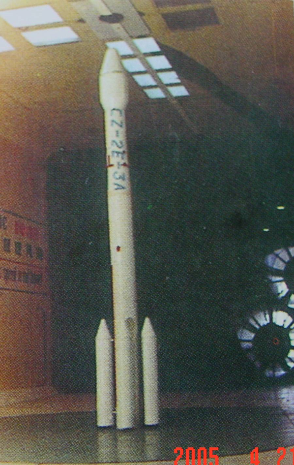

除了飞机之外，新的车辆也需要大量的空气动力学试验。

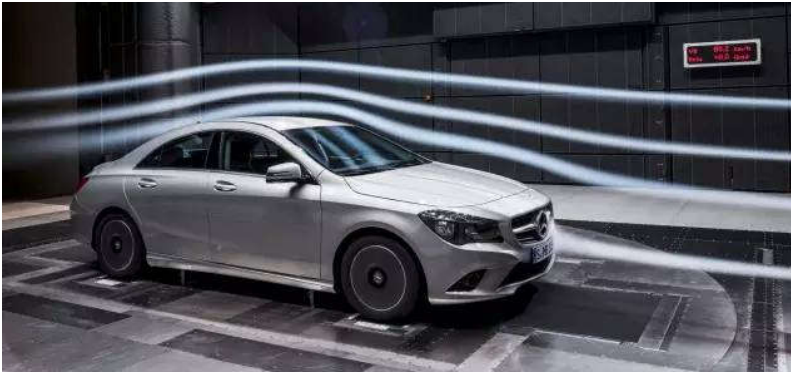

除了风洞试验之外，还可以采用地面试验、飞行试验来进行。

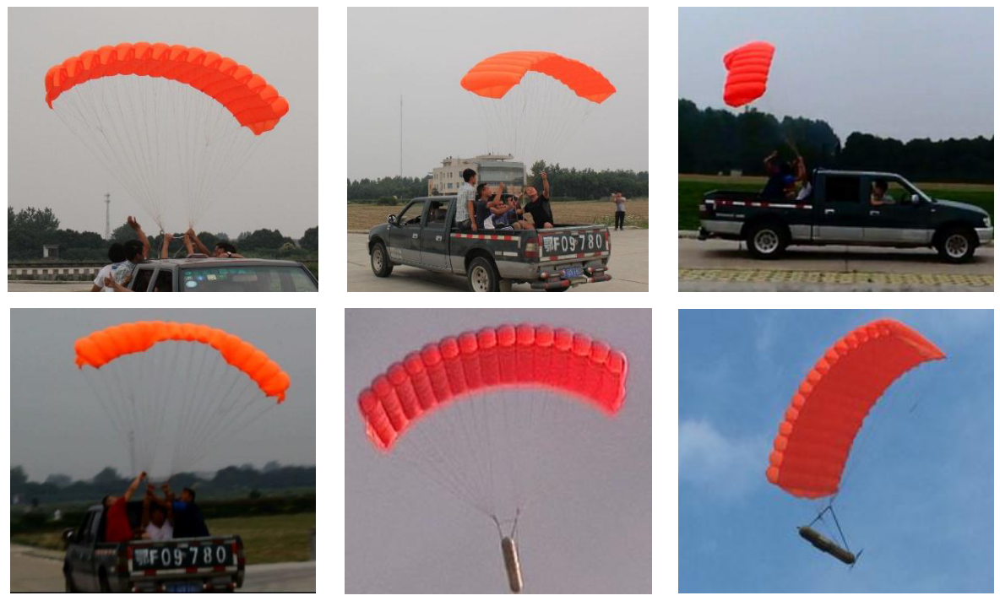

## 风洞试验为何可能？

风洞试验之所以能够模拟真实的飞行，其理论基石主要依赖于两大物理原理：相对性原理和相似性原理。

### 相对性原理

伽利略的相对性原理指出，力学规律在所有惯性系中都是等价的。这意味着，研究一个物体在静止空气中的运动，等效于研究一股气流流过一个静止的物体。这为在地面上建造设备来模拟空中飞行提供了根本的可能性。

### 相似性原理

要使模型在风洞中的试验结果能够准确反映真实飞行器（原型）的性能，二者的流动现象必须是“相似”的。这种相似性包含三个层次：

- **几何相似**：模型与原型的外形按比例缩放。
- **运动相似**：模型与原型各对应点的速度方向相同，速度大小成比例。
- **动力相似**：作用在模型与原型各对应点上的力，其方向相同，大小成比例。

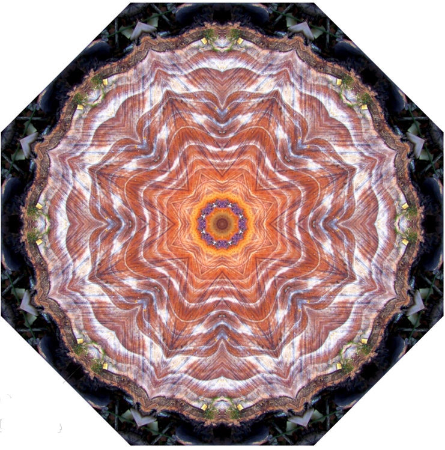

为了确保动力相似，我们需要引入一系列无量纲参数，即**相似数**。只要保证模型和原型的关键相似数相等，即便它们的尺寸、速度、流体介质不同，其流动也是动力相似的。

## 定量研究方法：量纲分析

对于一个复杂的物理问题，如飞行器受到的气动力$R$，它可能与飞行器的尺寸$L$、速度$v$、空气密度$\rho$、迎角$\alpha$等十几个变量有关：

$$
R = R(L, v, \rho, h,  \alpha, \beta, E, n_s, m, P, \mu, \bar{v}^2, \gamma, C_p, C_v, \lambda, V, \ldots)
$$

直接研究如此复杂的多元函数几乎是不可能的。**量纲分析**提供了一个强大的工具，可以将这个复杂的函数关系简化。通过将有单位的物理量组合成无量纲的$\Pi$数（即相似数），气动力系数$C_R$可以表示为一系列相似数的函数：

$$
C_R = \frac{R}{\frac{1}{2}\rho v^2 L^2} = C_R(\Delta, \alpha, \beta, C, \frac{m}{\rho L^2}, S, Ma, Re, \varepsilon, F, k, P_r)
$$

在这些相似数中，对于绝大多数空气动力学问题，最关键的是**马赫数（Ma）**和**雷诺数（Re）**。

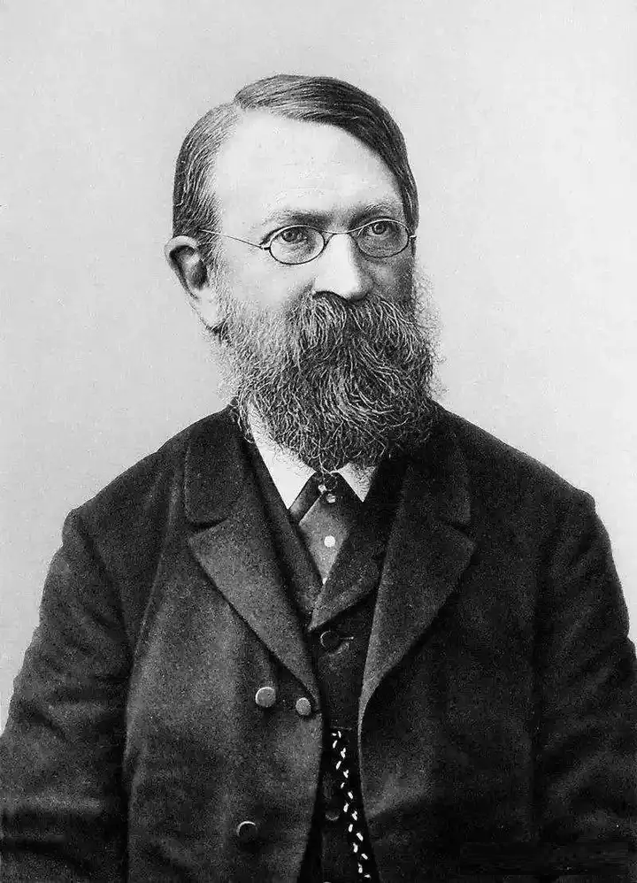

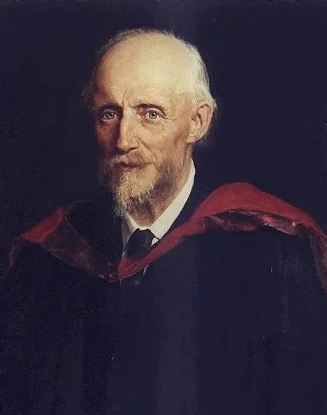

- **马赫数 (Ma)**: $v/a$，代表流速与声速之比，是衡量气体可压缩性的关键参数。当马赫数超过1时，会产生激波等独特的超声速流动现象。
- **雷诺数 (Re)**: $\rho v L / \mu$，代表惯性力与粘性力的比值，是判断流动状态（层流或湍流）和模拟粘性效应的关键参数。

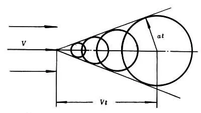
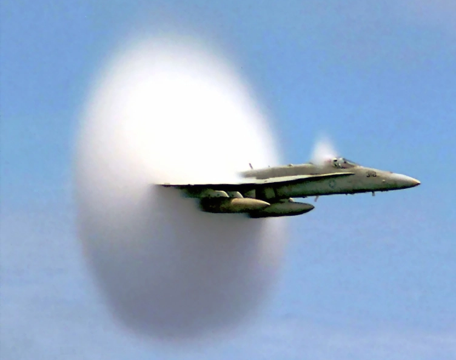

因此，风洞的核心任务可以被精炼为：**在地面上创造一个可控的流场，精确地模拟飞行器在真实飞行中所经历的关键相似数（主要是Ma和Re）**。

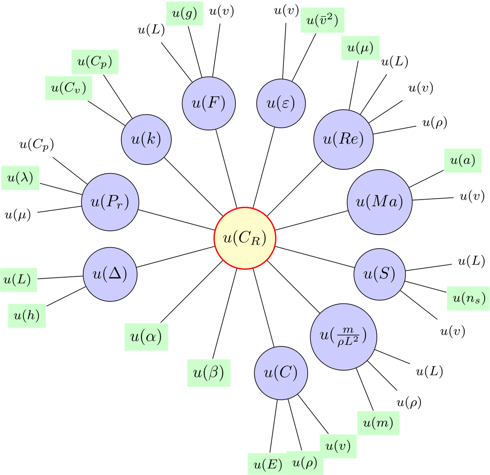

## 风洞的基本类型

根据其能够模拟的马赫数范围，常规风洞主要分为以下几类，每类风洞都有其独特的气动外形和设计特点：

- **低速风洞** (Ma < 0.4)
- **跨声速风洞** (0.4 < Ma < 1.2)
- **超声速风洞** (1.2 < Ma < 5)
- **高超声速风洞** (Ma > 5)

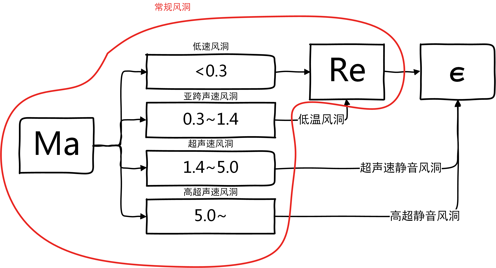

此外，根据回路特点，风洞可分为**直流式**和**回流式**。

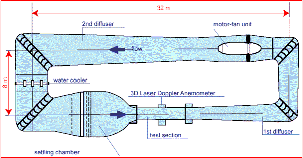
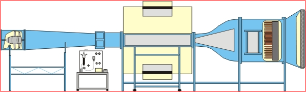

根据运行时间，可分为**连续式**和**暂冲式**。

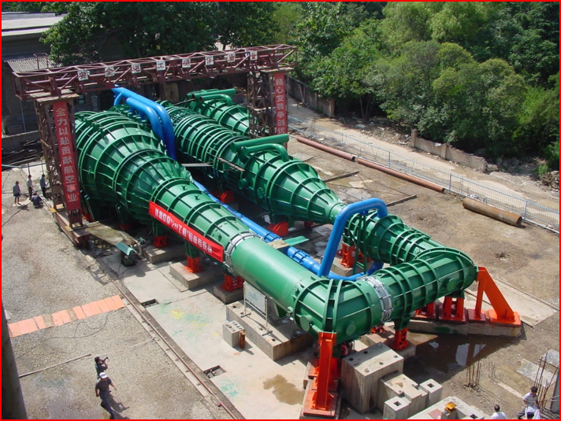
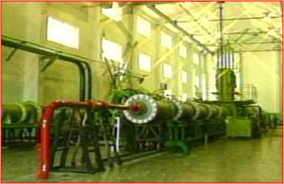
