# 风洞大开角性能评估CFD模拟

丛成华, 廖达雄, 陈吉明, 李红喆.  连续式风洞大开角扩散段流动控制数值模拟[J]. 工程力学, 2013, 30(3): 424-430. doi: 10.6052/j.issn.1000-4750.2011.10.0668

## 引言

连续式跨声速风洞的大开角扩散段必须在极为有限的空间内完成压力恢复与流场整流。文献针对 0.6 m × 0.6 m 连续式跨声速风洞，在换热器前设置大开角扩散段（Wide-Angle Diffuser, WAD），以实现直径 2.6 m 圆截面到 3.5 m × 3.5 m 方截面的过渡。由于扩散角高达 30.2°，若沿用传统经验公式容易在角点形成大范围分离，造成压力恢复效率下降并诱发低频脉动。作者综合 CFD 与多层阻尼网配置，研究阻尼网数量、位置与开孔率对流场均匀性和压力恢复的影响，为工程设计提供依据。

文章回顾了国内外关于扩散段流动控制的研究。Schubauer、Moore、Cochran 等的试验说明大开角扩散段的分离与压力恢复密切相关，Sahin、Chiccine、Hancock、Kulkarni 等进一步从阻尼网和扩散角度给出经验规律。在此基础上，作者提出利用多层阻尼网配合 CFD 优化，为自主研制的 0.6 m × 0.6 m 跨声速风洞总结设计方法。

## 大开角段设计与建模

大开角段与第二扩散段共同纳入计算域，坐标系以大开角段入口中心为原点。第二扩散段长度 13.7 m，面积比 3.45，扩散角 5.02°；大开角段长度 2.5 m，实现从直径 2.6 m 圆截面到 3.5 m × 3.5 m 方截面的过渡，当量扩散角为 30.2°。入口条件依据风洞设计流量确定，速度 45.8 m/s，对应试验段马赫数 0.9，总压 249 957 Pa，密度 2.912 kg/m³。出口采用匹配流量的压力边界，壁面为绝热无滑移条件。

阻尼网是大开角段内唯一的主动整流元件。文献将影响扩散段性能的因素分为外形参数和动态参数两类。在 0.6 m 风洞方案中，外形参数已确定，因此通过布置阻尼网来改善流动。研究对两层阻尼网进行参数化组合：第一层阻尼网布置在距入口 200–1 200 mm 的位置，开孔率 0.36–0.86；第二层阻尼网在此基础上沿流向布置 460–1 260 mm，开孔率 0.46–0.76，同时参考 Mehta、Scheiman 等提出的压降与稳定性准则，以减少系统压降。

## 数值方法

### 计算网格

计算采用约 300 万节点的结构化网格，壁面满足 y⁺ < 5 的分辨率要求，对潜在分离区域进行局部加密。拓扑结构如图 1 所示。

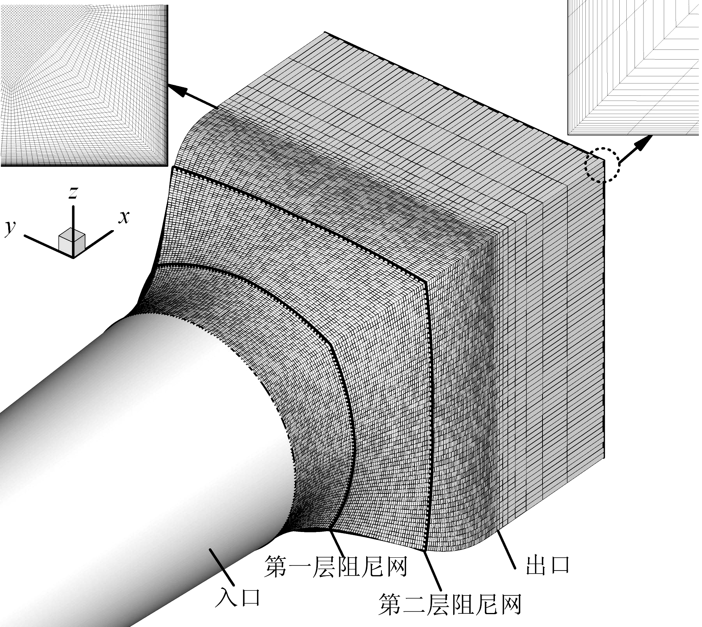

### 控制方程与湍流模型

求解稳态不可压 Navier–Stokes 方程，采用有限体积法、二阶空间离散和隐式时间推进。压力–速度耦合使用 SIMPLE 算法，湍流模型选用 k-ε 模型配合非平衡壁面函数。阻尼网通过动量源项加入动量方程。方程写成矢量形式为：

$$
\left\{
\begin{aligned}
&\frac{1}{\rho} \frac{\mathrm{D} \rho}{\mathrm{D} t} = -\partial_i v_i, \\
&\rho \frac{\mathrm{D} v_i}{\mathrm{D} t} = -\partial_i p + \partial_j \tau_{ji} + S_i,
\end{aligned}
\right.
$$

其中 $\partial_i$ 和 $\partial_j$ 分别表示对 $x_i$、$x_j$ 的偏导数，$\tau_{ji}$ 为黏性应力张量，$S_i$ 为模拟阻尼网附加的动量源项，其大小随阻尼网参数而变化。CFD 方法能够灵活改变阻尼网位置、开孔率和数量，便于获取三维流场数据并验证方案。

### 边界条件

入口给定均匀速度型，总压 249 957 Pa、密度 2.912 kg/m³、速度 45.8 m/s；出口使用压力边界并按流量匹配；壁面施加绝热无滑移条件；阻尼网阻力系数参考文献数据设定。

## 数值模拟结果

### 无阻尼网时

基准算例显示，在大开角段角点位置形成明显的逆压梯度分离，分离点位于 x ≈ 816 mm，出口速度型出现尖峰和速度亏损。图 2 给出了未布置阻尼网时的大开角段内部分离区，说明必须设置阻尼网抑制分离。

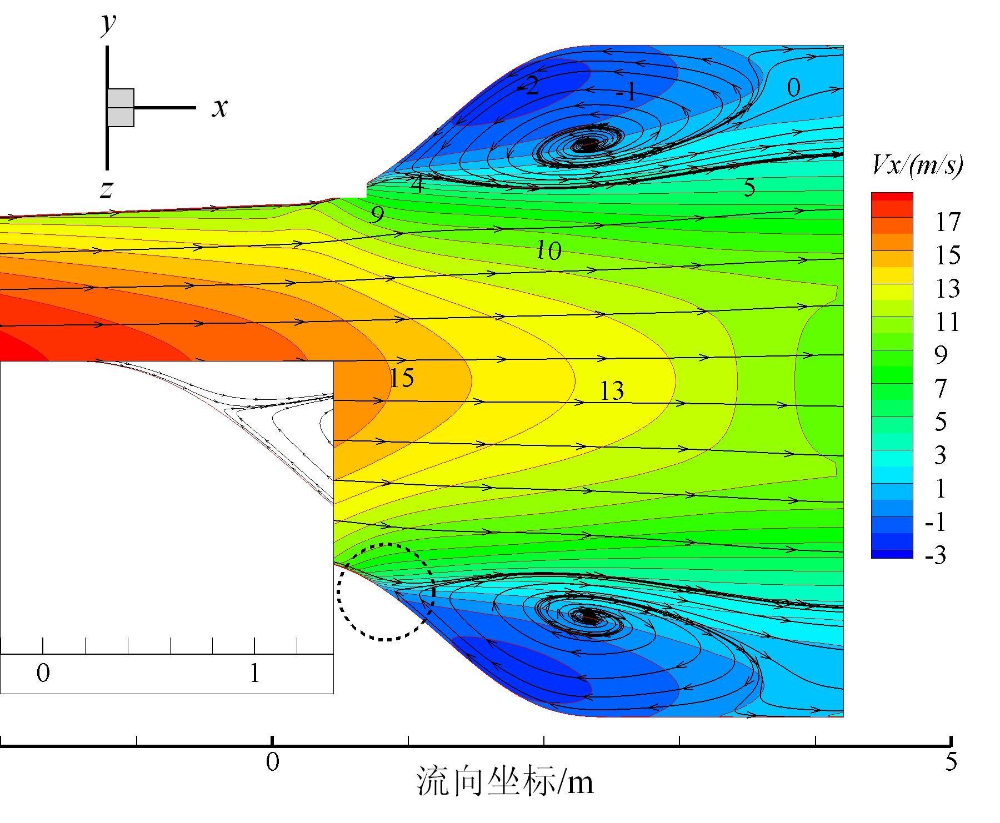

### 第一层阻尼网位置的影响

在开孔率固定为 0.66 的条件下，第一层阻尼网位置对分离控制至关重要。当阻尼网距入口不足 600 mm 时，分离仍在其后发展；移动至 800 mm 后，角点分离区明显缩小；若进一步后移至 1 660 mm 以上，则在阻尼网前产生新的分离团。图 3 与图 4 分别展示了不同位置下的流态和出口速度型，表明 L₁ = 800 mm 时兼顾分离抑制与出口均匀性。

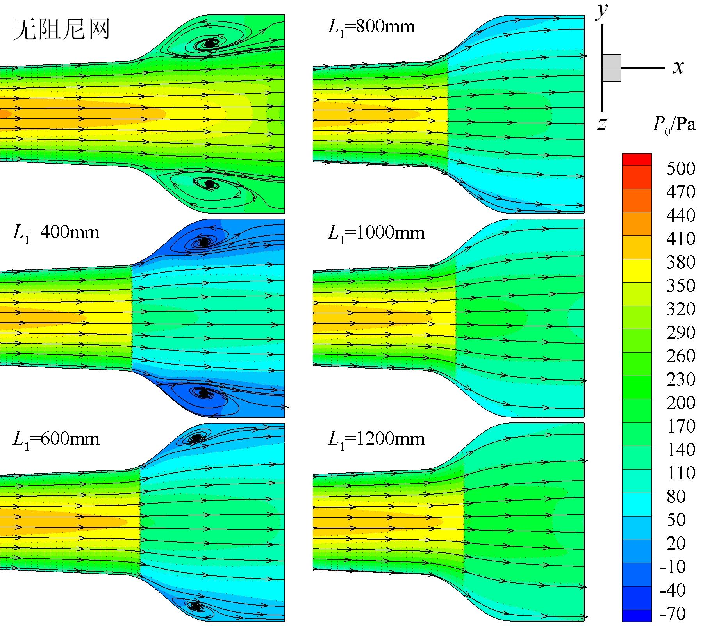

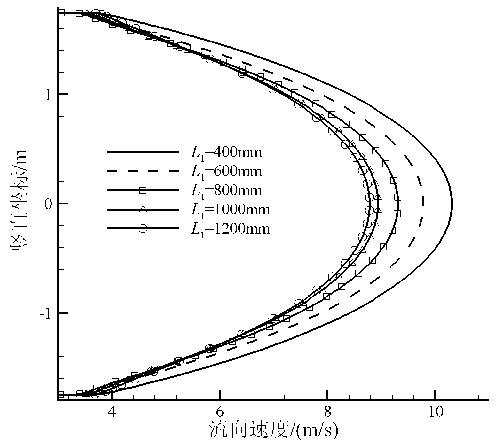

图 5 进一步展示了阻尼网位于 x = 1 660 mm 和 x = 2 060 mm 时的流态。阻尼网过于靠近出口会形成新的低压区，导致出口速度型劣化。

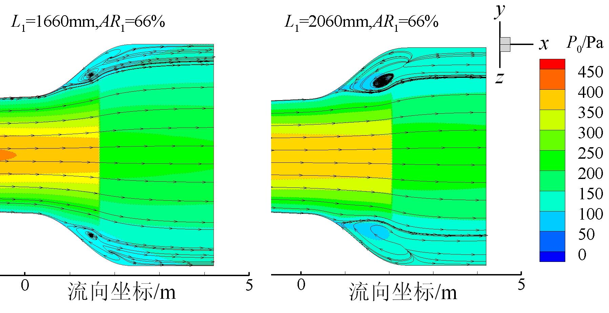

表 1 总结了单层阻尼网在不同位置与开孔率组合下的损失系数。当 L₁ = 800 mm、β₁ = 0.66 时，段损失系数较低并能维持分离控制；若开孔率降至 0.46 以下，虽然附着增强但压降显著增大。

| 工况 | L₁ = 400 mm | L₁ = 600 mm | L₁ = 800 mm | L₁ = 1 000 mm | L₁ = 1 200 mm | L₁ = 800 mm | L₁ = 800 mm | L₁ = 800 mm | L₁ = 800 mm | L₁ = 800 mm |
| :--- | ---: | ---: | ---: | ---: | ---: | ---: | ---: | ---: | ---: | ---: |
| β₁ | 0.66 | 0.66 | 0.66 | 0.66 | 0.66 | 0.36 | 0.46 | 0.56 | 0.76 | 0.86 |
| 损失系数 η | 0.1419 | 0.1288 | 0.1212 | 0.1126 | 0.1044 | 0.3564 | 0.2186 | 0.1540 | 0.1056 | 0.0938 |

### 第一层阻尼网开孔率的影响

在位置固定为 x = 800 mm 的条件下，开孔率影响出口速度型和边界层过冲。图 6 和图 7 显示，当 β₁ 从 0.36 提高到 0.66 时，出口速度型由壁面处的过冲逐渐转为平滑曲线；继续增大到 0.76 或 0.86 时，角点逆压梯度重新激活分离，与 Schubauer 及 NWTC 的实验结果一致。综合阻力和稳定性，建议 β₁ 控制在 0.60–0.66。

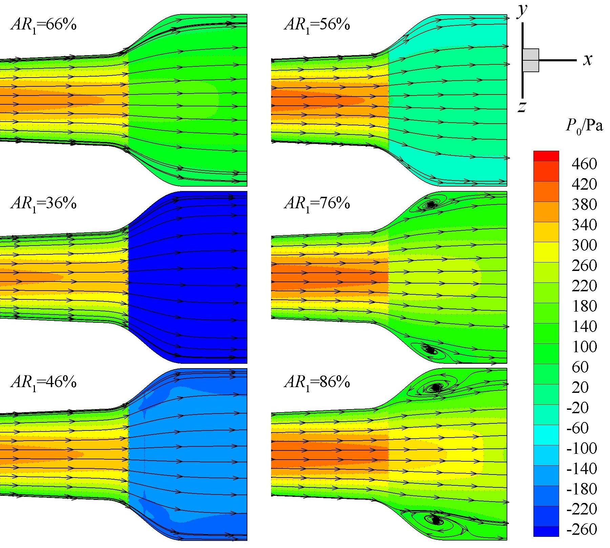

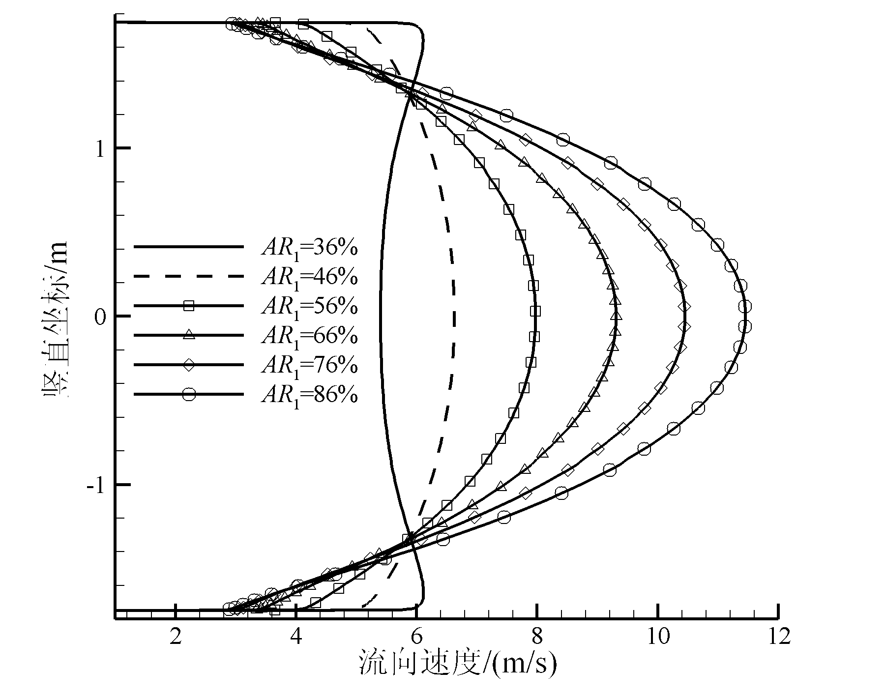

### 第二层阻尼网布置位置的影响

当第一层阻尼网参数固定后，增加第二层阻尼网可进一步提高防分离能力。第二层阻尼网布置在与第一层间距 1.0–1.2 m 的位置时，既能保持较小的段损失，又能改善出口速度型。图 8 给出了不同布置位置下的出口速度型，曲线差异较小，表明第二层阻尼网应布置在靠近出口的 0.6 < x₂/L < 1.0 区域，以减小压力损失并提高湍流度。

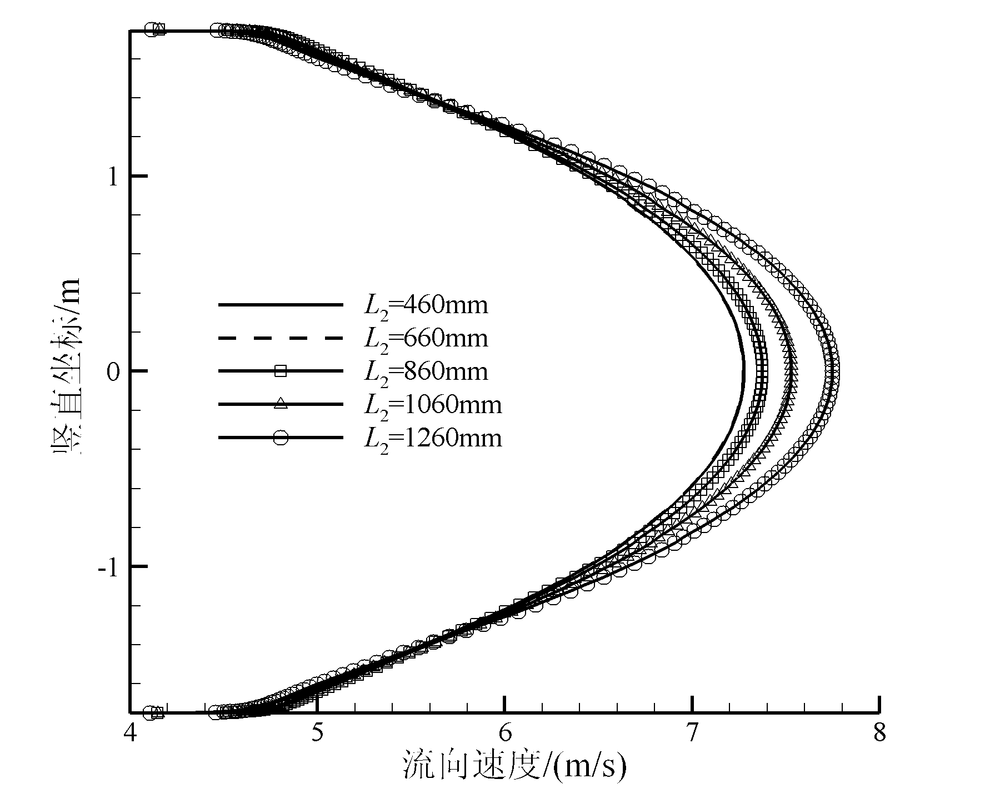

### 第二层阻尼网开孔率的影响

图 9 对比了第二层阻尼网不同开孔率下的出口速度型。当 β₂ < 0.56 时，壁面附近速度出现过冲；β₂ 增至 0.56–0.66 后曲线最为光顺，再继续增大则中心区速度凸起。表 2 列出了在 L₁ = 800 mm、β₁ = 0.66 时，第二层阻尼网参数变化对应的损失系数，显示 L₂ = 1 660 mm、β₂ = 0.86 工况损失最小，而开孔率过低会显著增加段损失。

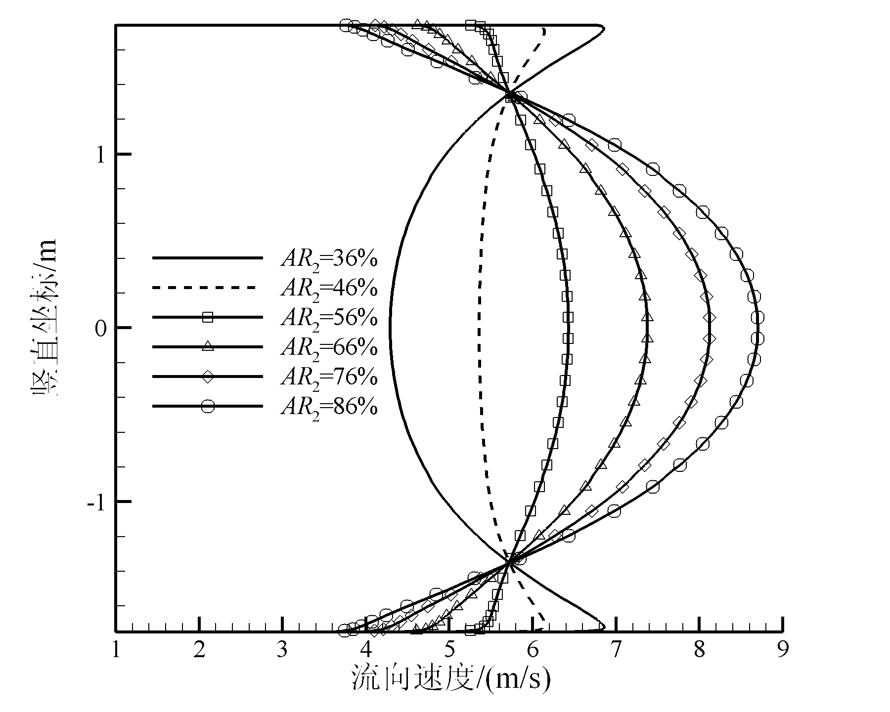

| L₂ 位置 | 1 260 mm | 1 460 mm | 1 660 mm | 1 860 mm | 2 060 mm | 1 660 mm | 1 660 mm | 1 660 mm | 1 660 mm | 1 660 mm |
| :--- | ---: | ---: | ---: | ---: | ---: | ---: | ---: | ---: | ---: | ---: |
| β₂ | 0.66 | 0.66 | 0.66 | 0.66 | 0.66 | 0.36 | 0.46 | 0.56 | 0.76 | 0.86 |
| 损失系数 η | 0.1470 | 0.1398 | 0.1389 | 0.1351 | 0.1310 | 0.2252 | 0.1759 | 0.1494 | 0.1294 | 0.1185 |

## 分析与讨论

阻尼网通过动量损失降低核心流速度、增厚边界层，使逆压梯度下的分离点后移或消失。文献采用的段损失系数定义为

$$
\eta = \frac{\Delta p}{q_d} = 1 - \frac{P_2 - P_1}{P_d} = 1 - C_p
$$

其中 $\Delta p$ 为总压损失，$q_d$ 为大开角段入口动压，$P_d$、$P_1$、$P_2$ 分别为大开角段入口动压、入口静压和出口静压，$C_p$ 为压力恢复系数。由于壁面效应、边界层与分离的存在，入口截面的静压和动压并非均匀，作者采用质量加权平均方式确定平面上的压力与速度。表 1 表明使用阻尼网后段损失系数总体增加，但合理位置与开孔率能够兼顾分离抑制与压降；表 2 进一步说明第二层阻尼网有助于减小损失并稳定出口速度型。

图 10 给出了不同整流方案的静压沿程分布，双层阻尼网能够使中心线压力恢复曲线更加平滑，并在 x = 800 mm 后消除长平台。图 11 显示壁面摩阻系数在阻尼网附近明显提升，说明核心流向壁面输送动量，角点低能量区被削弱。

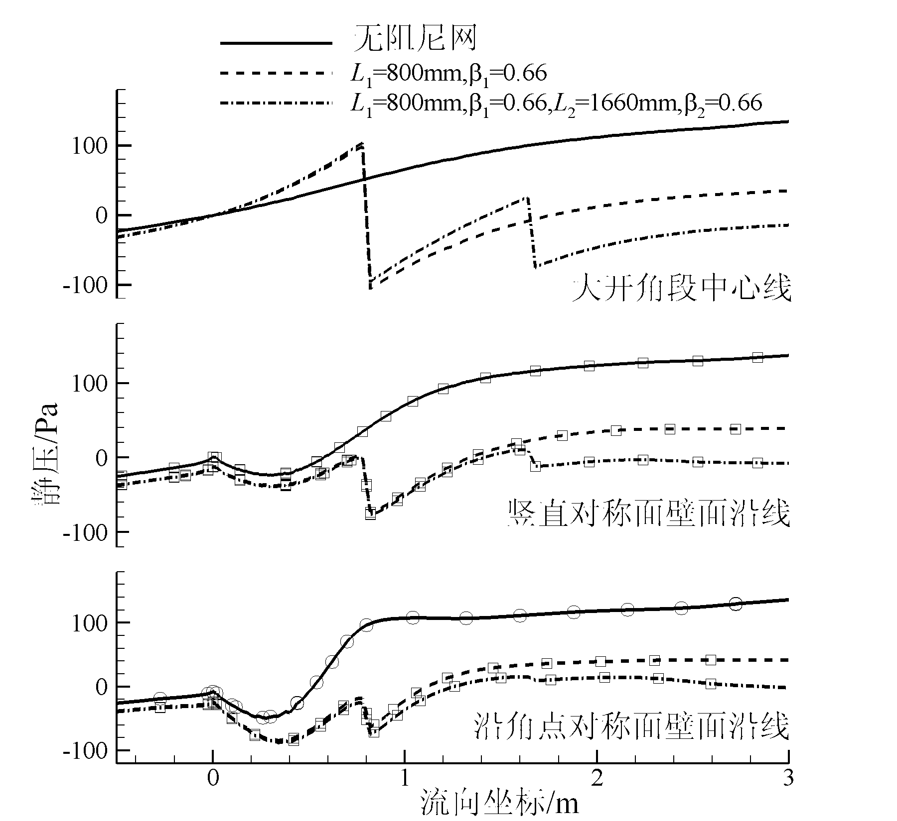

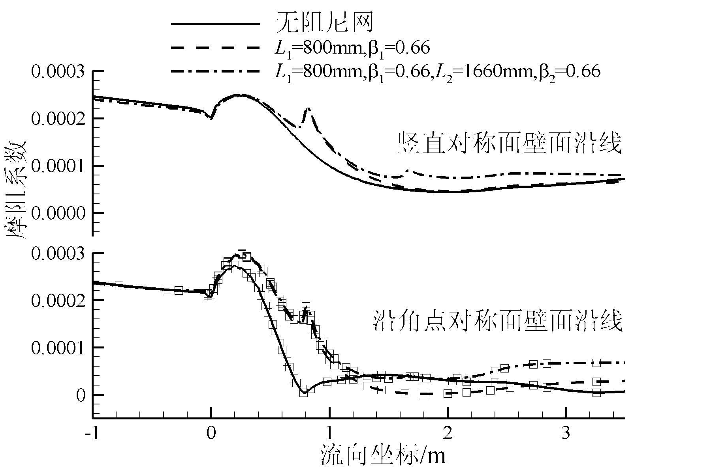

当第一层阻尼网位于潜在分离点之前时，可显著减弱角点低速区；第二层阻尼网通过调整出口速度型，提高换热器入口的均匀性并提升压力恢复。若分离一旦发展，压力恢复效率会迅速下降，因此在保证静压增益的同时，需要以最少的阻尼网层数实现有效控制。

## 结论

研究基于现有边界条件，通过 CFD 系统考察了阻尼网布置方案，总结出如下认识。首先，合理设置阻尼网能降低来流湍流度，减薄边界层，使其能够抵抗逆向压力梯度，出口流场由此保持均匀。其次，第一层阻尼网应布置在大开角段分离点附近并配合 0.56–0.66 的开孔率，第二层阻尼网应放置在靠近出口的位置以微调速度型，其开孔率同样保持在 0.56–0.66 范围内。最后，在不同入口工况下，上述阻尼网配置仍表现良好，尽管数值方法尚有局限，但对复杂外形的优化设计具有重要参考价值，为大型连续式跨声速风洞的工程化设计提供了依据。
